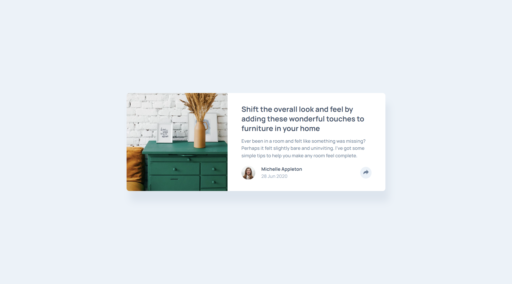

# Frontend Mentor - Article preview component solution

This is a solution to the [Article preview component challenge on Frontend Mentor](https://www.frontendmentor.io/challenges/article-preview-component-dYBN_pYFT). Frontend Mentor challenges help you improve your coding skills by building realistic projects. 

## Table of contents

- [Overview](#overview)
  - [The challenge](#the-challenge)
  - [Screenshot](#screenshot)
  - [Links](#links)
- [My process](#my-process)
  - [Built with](#built-with)
  - [What I learned](#what-i-learned)
  - [Continued development](#continued-development)
  - [Useful resources](#useful-resources)
  - [AI Collaboration](#ai-collaboration)
- [Author](#author)
- [Acknowledgments](#acknowledgments)

## Overview

### The challenge

Users should be able to:

- View the optimal layout for the component depending on their device's screen size
- See the social media share links when they click the share icon

### Screenshot

### Links

- Solution URL: [Solution URL]()
- Live Site URL: [Live Site URL]()

## My process

### Built with

- Semantic HTML5 markup
- CSS custom properties
- Flexbox
- Mobile-first workflow
- javaScript

### What I learned

- I learned how to use js to control elements classList.
- Using pointer events to prevent clicking on links with 0 opacity.
- Using JavaScript to close the share-box when clicked outside the share-box.

### Continued development

### Useful resources

- Used this site to download the fonts > https://gwfh.mranftl.com/fonts/fraunces?subsets=latin .

### AI Collaboration

- Asked gemini to calculate the clamp values for me.
- Asked gemini to teach me how to close the share-box when clicked outside it instead of toggle the classList to show and hide the share box.

## Author

- Frontend Mentor - [@Faith-Rose1](https://www.frontendmentor.io/profile/Faith-Rose1)

- Instagram: [@bluebutterfly00777](https://www.instagram.com/bluebutterfly00777/)

- Twitter: [@ButterflyNana7](https://x.com/ButterflyNana7)

## Acknowledgments
